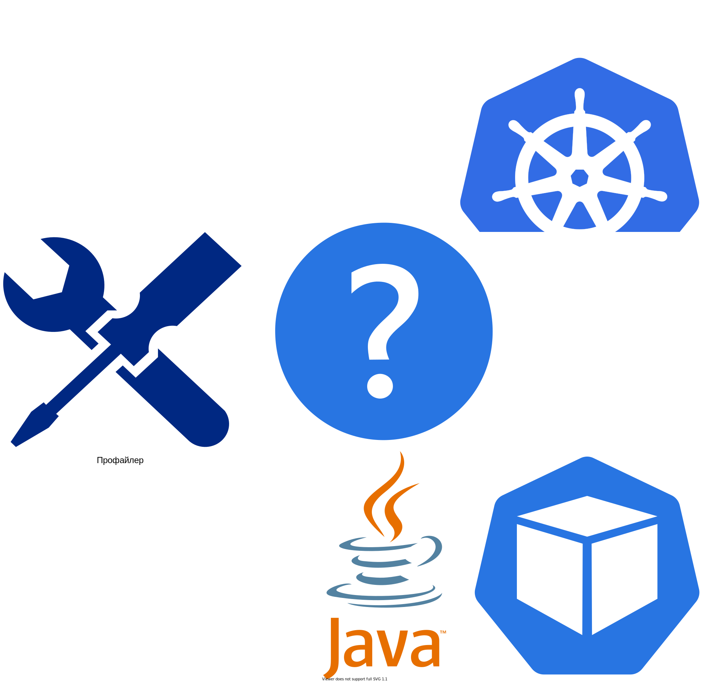
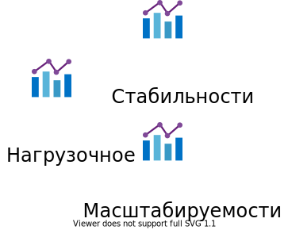
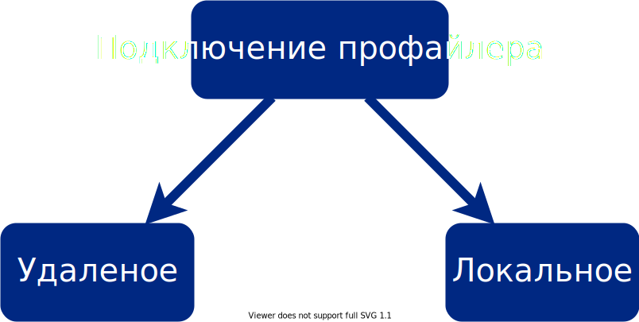
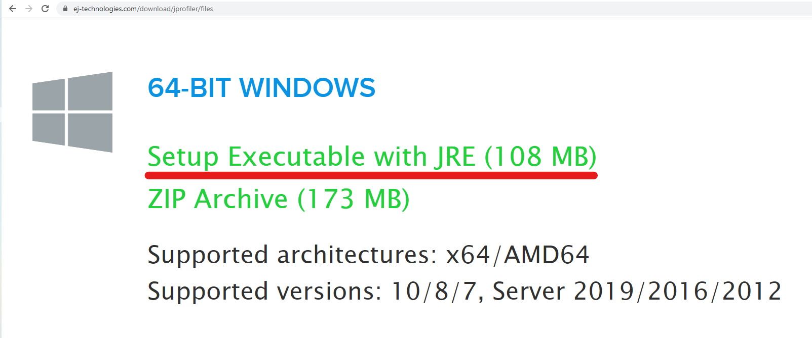
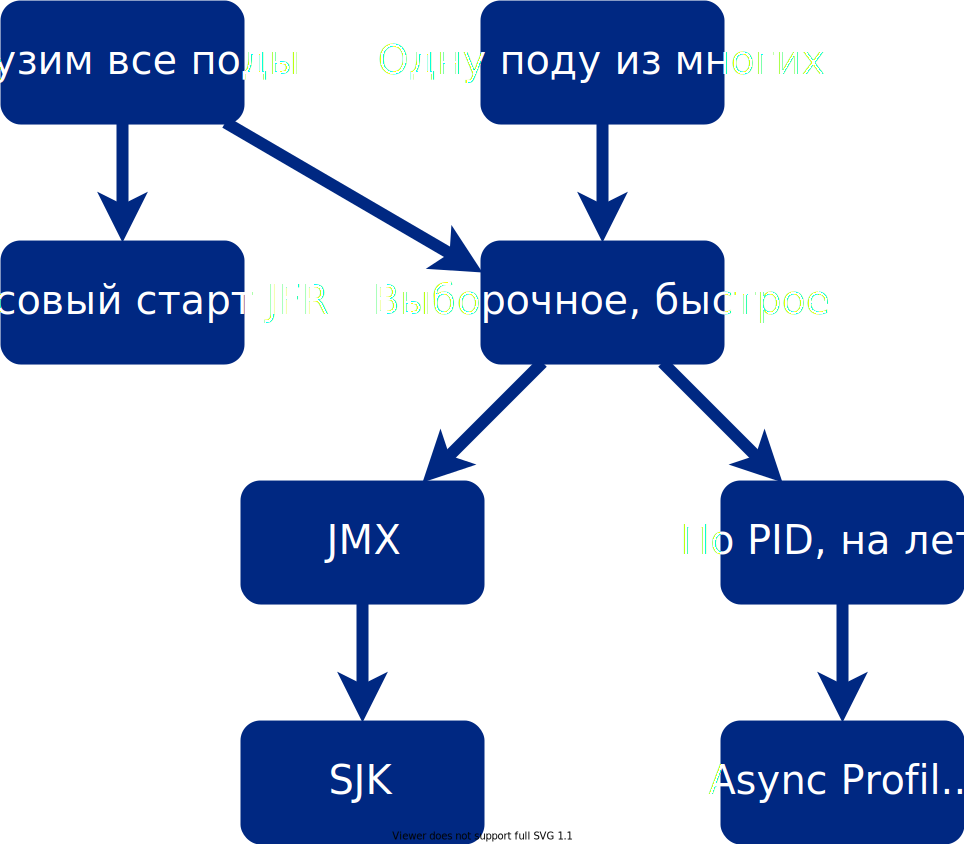
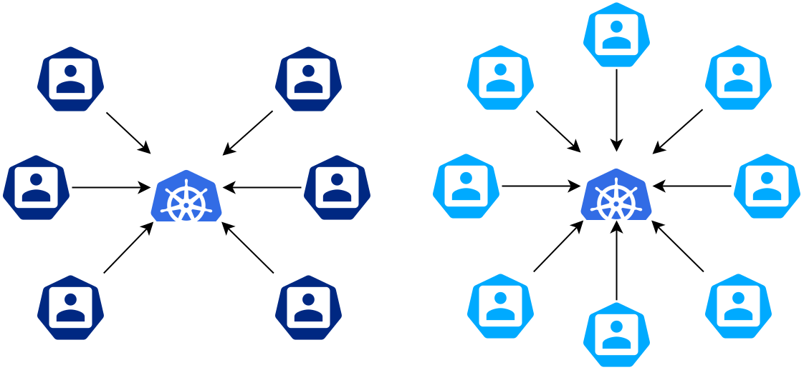
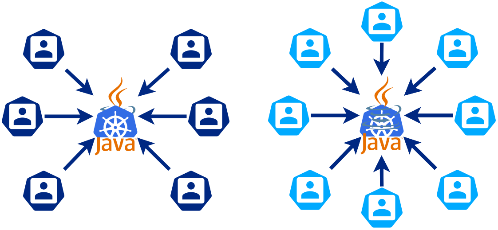
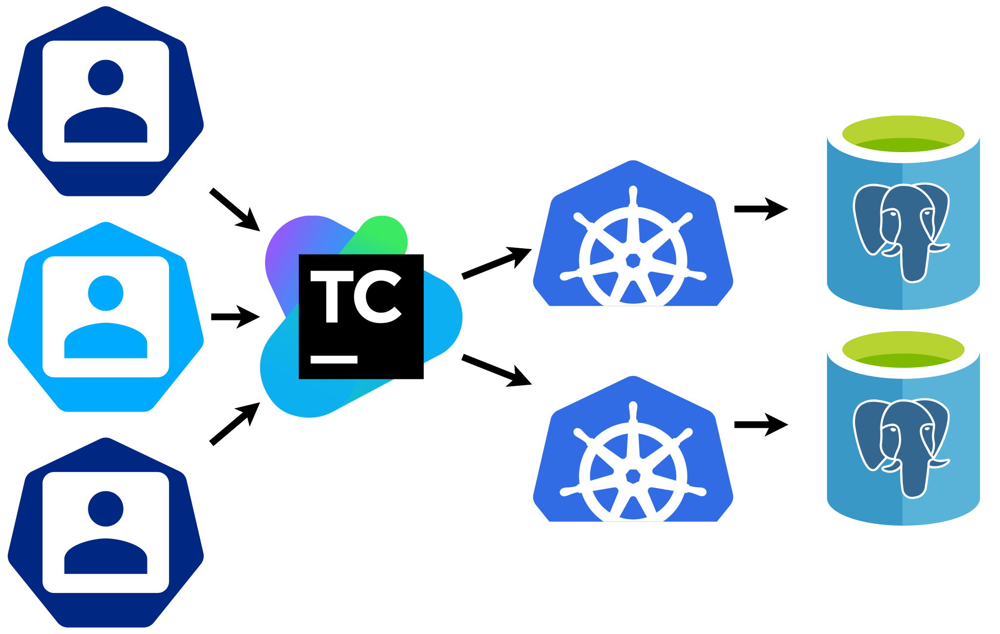
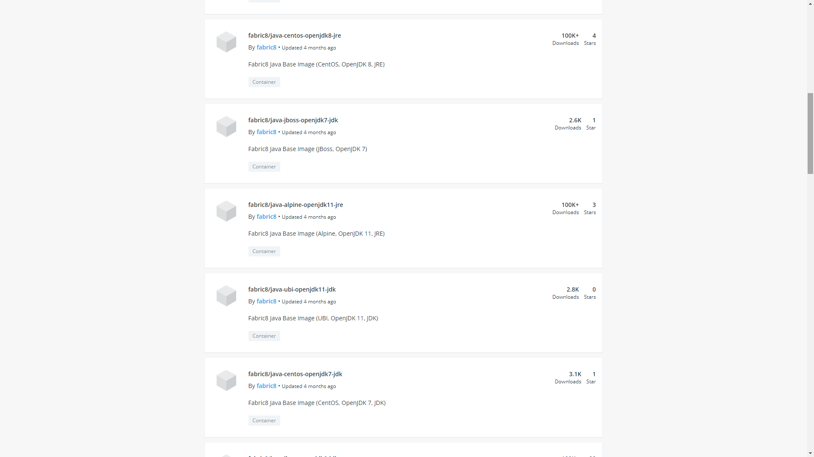

<!-- _class: lead2-->

# Профилирование JVM в Kubernetes : три больших шага
## __Смирнов Вячеслав, 2021__

<!--

# Масштабирование сервисов и их профилирования 

Микросервисная архитектура является популярной.

Kubernetes позволяет запускать множество микросервисов и предоставляет API доступа к ним. Сотни сервисов. С каждым из которых работают разные инженеры.

Часто нужно узнать детали работы приложения в контейнере. Нужна трассировка или профилирование. А также последующий анализ результатов. И этим также будут заниматься разные инженеры.

Расскажу, как можно сделать процесс профилирования проще. Мастабировать его на все сервисы и всю команду.

# Этапы профилирования и стадии масштабирования

Для трассировки и профилирования нужно добавить внутрь контейнера специальные инструменты, которых в легковесных контейнерах нет. Часто в контейнерах нет ни JDK, ни утилит профилирования, ни утилит трассировки, ни прав админа, ни доступа к репозиториям пакетов и сети Интернет, чтобы установить недостающие пакеты.

Но выполнить профилирование можно:

- примонтировать в контейнер каталоги с файлами
- изменить параметры запуска JVM
- запустить внутри контейнера команды
- скачать из контейнера файлы с результами

Это повторяемый однообразный процесс, особенно, когда на тестовом стенде работает 100 микросервисов.

При этом, это непростой процесс. А его должна уметь выполнять вся команда. Чтобы масштабировать запуск профилирования на всю команду можно:

- написать подробную инструкцию
- выполнять профилирование по Skype/Zoom/... совместно
- автоматизировать процесс с помощью скриптов
- организовать запуск профилирования из CI/CD

Но потом понадобится анализ результатов профилирования. Анализ становится повторяемым однообразным процессом, особенно, когда на тестовом стенде работает 100 микросервисов, которые нужно регулярно профилировать.

Анализ - получение фактов, сравнимых чисел, из результатов профилирования.

При этом, это непростой процесс. А его должна уметь выполнять вся команда. Чтобы мастабировать анализ результатов профилирования на всю команду можно:

- написать подробные отчеты
- выполнять анализ профилирования по Skype/Zoom/... совместно
- автоматизировать процесс анализа результатов с помощью скриптов
- организовать анализ результатов профилирования из CI/CD

А в завершении анализа, бывает нужно сравнить текущие результаты с предыдущими. Чтобы сделать вывод - ускорился метод или нет. И этот этап также нуждается в масштабировании и автоматизации.

Таким образом выделяется четыре этапа:

1. Подготовка микросервиса к профилированию
2. Запуск профилирования
3. Анализ результатов
4. Сравнение

Каждый из которых проходит четыре стадии:

1. Описание в виде инструкции
2. Совместное выполнение с коллегой
3. Автоматизация процесса с помощью скриптов
4. Возможность запуска скриптов с помощью CI/CD

# Технологии автоматизации этапов профилироваия

Благодаря Kubernetes и инструменту kubectl, есть единый для всех сервисов способ выполнения первых двух этапов:

- Подготовка микросервиса к профилированию
- Запуск профилирования

Благодаря возможностям инструментов профилирования по запуску в консольном режиме, есть автоматизируемый способ выполнения второго и третьего этапа.

- Запуск профилирования
- Анализ результатов

И если профилирование проводилось для сервисов, работающих при схожей нагрузке, и проводилось схожим образом, то сравнить результаты профилирования можно и скриптом и в Excel и в Grafana:

- Сравнение тоже автоматизируется

Интересно, как это можно сделать?

# Kubernetes, JVM в Docker и kubectl

Популярные образы с OpenJDK от fabric8

| Name   | OS  | Ver  | Dev?   | Hit  |
|---|---|---|---|---|---|
| [s2i-java](https://hub.docker.com/r/fabric8/s2i-java)  | CentOS  | 8/11  | JRE  | 10M  |
| [java-centos-openjdk8-jre](https://hub.docker.com/r/fabric8/java-centos-openjdk8-jre)  | CentOS  | 8  |  JRE  |  100k  |
| [java-centos-openjdk8-jdk](https://hub.docker.com/r/fabric8/java-centos-openjdk8-jdk) | CentOS | 8  | JDK   |  100k |
| [java-alpine-openjdk8-jre](https://hub.docker.com/r/fabric8/java-alpine-openjdk8-jre) | Alpine | 8  | JRE   |  100k |
| [java-alpine-openjdk8-jdk](https://hub.docker.com/r/fabric8/java-alpine-openjdk8-jdk) | Alpine | 8  | JDK   |  100k |
| [java-alpine-openjdk11-jre](https://hub.docker.com/r/fabric8/java-alpine-openjdk11-jre) | Alpine | 11  | JRE  |  100k |

Небольшое разнообразие.

Кроме таких JVM также применяется IBM OpenJ9.

С помощью kubectl можно:

- менять Deployment-файл
    - монтировать каталоги в контейнер
    - менять JAVA_OPTIONS
        - добавлять javaAgent
        - открывать JMX/RMI-порты
        - менять другие параметры запуска JVM
- копировать файлы в контейнер
- получать доступ до сетевых портов контейнера
- запускать команды внутри контейнера
- копировать файлы из контейнера

Это все, что нужно для запуска и получения результатов профилирования.

# JVM профайлеры

У популярных инструментов и технологий профилирования есть консольный режим запуска:

- JDK Flight Recorder c утилитой jcmd или параметрами запуска JVM
- SJK с подключением по JMX/RMI или по PID-процесса
- AsyncProfiler с утилитой jattach или JVM агентом
- JProfiler с утилитой jpenable или JVM агентом
- YourKit с утилитой yjp-controller-api-redist.jar и JVM агентом

У профайлеров есть разные варианты сбора событий:

- JDK Flight Recorder собирает внутренние события JVM
- SJK использует семплирование
- AsyncProfiler использует семплирование
- JProfiler использует и семплирование и инструментацию
- YourKit использует и семплирование и инструментацию

Выделяется три варианта сбора событий по длительности работы кода:

- внутренние события
- семплирование
- инструментация

Инструментация требует значительных накладных расходов, большое приложение может проходить инструментацию, предшествующую началу профилирования от 20 до 60 минут. И приложение значительно замедляется при выполнении профилирования с инструментацией.

Таким образом для повседневного профилирования рекомендется использовать подход JDK Flight Recorder со сбором внутренних событий JVM, почти без накладных расходов. И подход с семплированием потоков с небольшими накладными расходами.

# Визуальный анализ результатов

- Java Mission Control для JFR-файлов
- Flame-диаграммы в SJK
- Flame-диаграммы в AsyncProfiler
- JProfiler GUI и экспорт в HTML в JProfiler
- YourKit GUI и экспорт в HTML в YourKit

# Анализ и сравнение результатов

Также есть программный и консольный режим анализа результатов профилирования, превращения файла с результатами профилирования в числа, записанные в текстовом формате:

- Для jfr-файлов от JDK Flight Recorder и AsyncProfiler:
    - OpenJDK Mission Control Java API для работы с jfr
    - SJK jfr2json с сохранением в JSON
    - SJK ssa для allocation и exception с сохранением в TXT и CSV
- Для sdt-файлов от SJK:
    - SJK ssa с сохранением в TXT и CSV
    - SJK dexp c сохранением в CSV
- Для JProfiler:
    - jpexport с сохранением в XML и CSV
- Для YourKit:
    - консольный экспорт в XML, CSV, TXT 

Для анализа нужны как визуальные так и числовые результаты профилирования. Чтобы такие результаты получить надо будет запустить консольные команды и скрипты с различными параметрами.

Разработкой таких скриптов и предлагаю заняться.

# Сравнение результатов

Инструменты профилирования позволяют сохранять результат в CSV-формат. А данные в формате CSV удобно сравнивать.

Для сравнения результатов достаточно данных:

- по активности потоков
- по активности прикладных методов

То есть сравнение не ищет узкие места, оно показывает измениласть ли длительность работы потоков и методов, и если изменилась, то они стали работать меньше или больше.

# Хранение результатов

Кроме сбора и анализа результатов возникает задача удобного хранения. Так, чтобы место хранения было общедоступным. Чтобы результаты можно бы было прикрепить к дефекту и отчету. Чтобы структура хранения была удобной.

Удобно хранить файловые результаты профилирования в nexus / artifactory / ... - в хранилище артефактов с веб-интерфейсом, которое обычно есть инфраструктуре разработки для JVM. А числовые результаты профилирования в PostgreSQL, InfluxDB и отображать их в Grafana - веб-интерфейс для чистовых данных, которое обучно есть в инфраструктуре тестирования производительности.

# Тестовый стенд

Соберем тестовый стенд в котором будут:

- JVM-приложение SpringBoot в Kubernetes

Не в Kubernetes будут работать:

- TeamCity Server
- TeamCity Agent, с которого будет запускаться профилирование
- TeamCity Agent, с которого будет подаваться нагрузка
- Nexus для хранения результатов
- influxdb - timeseries база данных, используется для хранения клиентских метрик
- prometheus - система мониторинга, используется для сбора и хранения метрик cadvisor
- grafana - система визуализации, используется для визуализации метрик/логов
- loki - система аггрегации логов, используется для хранения логов
- vector - коллектор логов, используется для отправки логов в loki
- cadvisor - коллектор метрик docker, используется для сбора метрик всего окружения
- github.com в качестве git-репозитория


# Настройка локального Kubernetes

https://kubernetes.io/docs/tasks/tools/

- kubectl
- minikube

git clone https://github.com/polarnik/JVM-profiling-in-Kubernetes
cd ./JVM-profiling-in-Kubernetes/services/
./setup.sh


!! Скрипт при работе удаляет кластер с именем minicube и создает его снова


-->


---


# Исследую и создаю результаты нагрузки в ВТБ, ДБО: vtbbo.ru

## __И развиваю чат [@qa_load](https://t.me/qa_load)__


---

- На каком этапе мы подключаем профилировщик
- реплики


- Java должна быть поверх Kubernetes а не наоборот
- Как мы профилируем
- Масштабирование - часть звучала обще, тут нужна конкретика про Kubernetes, показать примеры, где это нужна почему это нужно на примере облаком, нужны примеры и картинки.

- Сколько потоков нужно на два ядра - 2 или 22
- Мы управляем только потоками или ядрами
- Вместо состояний потоков

- Более явно разобрать пазл
- Картинку показывать один раз

- глибс, масл

- Бизнес-отчет
- Какой Scale нужен
- Какие Request/Limit нужны
- Какой коэффициент масштабирования


- Выводы, более явно что людям делать
- 3-4 совета
- простые и не длинные
- что сделать дальше
- к чему стремиться
- чего бояться
- где подкладывать соломку
- что будет при переходе от VM к Kubernetes

- Как сравнить Zipkin/Jaeger и JVM профайлер
- Как собрать цифры с этой системы, 0-й уровень, пусть система сама все скажет


# 100 JVM работающих друг с другом и базой
## __На тестовом стенде__


<!--
- Отлдельно заострить внимание на тестовом стенде
- Подход к мониторингу на продуктиве несколько другой

- особенность работы именно в Kubernetes
    - как запустить профилирование на 1 поде из 12
    - как собрать результаты при падении
    - почему нужно увеличить память и CPU limit

- особенность работы с Alpine
    - другой способ запуска
-->


---


# Особенности профилирования JVM в Kubernetes

## __Особенности Kubernetes__


---

# Выделение ресурсов для нужд профилирования

## __Особенности Kubernetes__


---

# Как выполнять анализ: от потоков к коду

## __Анализ__ 


---

# Анализ взаимодействия микросервисов

## __Анализ__


---

# Cтандартизация процесса в большой команде

## __Масштабирование__


---

# Обмен знаниями, передача опыта, автоматизация

## __Масштабирование__


---


<!-- _footer: 
Изображение <a href="https://pixabay.com/ru/users/nicolaticola-2681567/?utm_source=link-attribution&amp;utm_medium=referral&amp;utm_campaign=image&amp;utm_content=1736209">Nicola Redfern</a> с сайта <a href="https://pixabay.com/ru/?utm_source=link-attribution&amp;utm_medium=referral&amp;utm_campaign=image&amp;utm_content=1736209">Pixabay</a>
-->


---

# Особенности профилирования JVM в Kubernetes

## __Особенности Kubernetes__


---

# Бизнес-отчет по тестированию производительности

## __Особенности Kubernetes__




---

# Бизнес-отчет по тестированию производительности

## __Особенности Kubernetes__


---


---


---


---


---

# Увеличиваем количество потоков или реплик?

## __Особенности Kubernetes__


---


---


---

# Когда JVM профайлер не нужен и чем его заменить

## __Особенности Kubernetes__


---


---


---


---


---


---


---


---


---

# Влияние количества потоков сервиса на профилирование

## __Особенности профайлеров__


---

<!-- _class: head-->

# Если нужно посчитать процент активности 


Инструмент | Примечание
------ | -------
__JFR__ (Java Fligth Recorder) | 
__SJK__ (Swiss Java Knife) |
__AsyncProfiler__ |
__JVisualVM__ | в режиме семплирования
__JProfiler__ | в режиме семплирования
__YourKit Java Profiler__ | в режиме семплирования

---

<!-- _class: head-->

# Stack Trace


---


Метод | Семплы
------ | -------
HashMap.putVal | 4
HashMap.put | 5
HttpContext.setAttribute:75 | 7
CoreContext.setAttribute:105 | 7
Impl.setupClient:1050 | 8
Impl.sample:613 | 8
Proxy.sample:613 | 8
... | __9__


---

<!-- _class: head-->

Метод | Семплы
------ | -------
HashMap.putVal | 49%
HashMap.put | 57%
HttpContext.setAttribute:75 | 77%
CoreContext.setAttribute:105 | 79%
Impl.setupClient:1050 | 80%
Impl.sample:613 | 81%
Proxy.sample:613 | 81%
... | __90%__

---
<!-- _class: head-->

# Соберем тестовый стенд


---

<!-- _class: head-->

# Результаты замеров длительности

Средняя длительность для | мсек
------ | ------- 
HTTP-запрос | 100  
SQL-запрос | 50 
Java-метод | 10 

---

<!-- _class: head-->

# Профилирование надо проводить под нагрузкой
## __1000 Java-методов * 3 потока * 10 мс / 11 мс = 2 700 семплов__

Средняя длительность для | мсек | частота (в сек)
------ | ------- | ---
HTTP-запрос | 100 | 
SQL-запрос | 50 | 
__Java-метод__ | __10__ | 
SJK (__3 активных потока__ + 120 спящих) | __11__ | 90

---

<!-- _class: head-->

# Профилирование надо проводить под нагрузкой
## __1000 HTTP запросов * 3 потока * 100 мс / 11 мс = 27 000 семплов__
 
Средняя длительность для | мсек | частота (в сек)
------ | ------- | ---
__HTTP-запрос__ | __100__ | 
SQL-запрос | 50 | 
Java-метод | 10 | 
SJK (__3 активных потока__ + 120 спящих) | __11__ | 90


---

<!-- _class: head-->

# Меньше спящих потоков - выше точность
## __1000 HTTP запросов * 3 потока * 100 мс / 3.5 мс = 85 000 семплов__

Средняя длительность для | мсек | частота (в сек)
------ | ------- | ---
__HTTP-запрос__ | __100__ | 
SQL-запрос | 50 | 
Java-метод | 10 | 
SJK (3 активных потока + 120 спящих) | 11 | 90
SJK (__3 активных потока__ + 20 спящих) | __3.5__ | 290

---

<!-- _class: head-->

# Меньше спящих потоков - выше точность


---

<!-- _class: head-->

# Снижаем server.tomcat.max-threads с 100 до 5


---

<!-- _class: head-->

# Снижаем server.tomcat.max-threads с 100 до 5

## __Повышается точность профилирования в 3 раза__


---

<!-- _class: head-->

# Снижаем server.tomcat.max-threads с 200 до 5

## __Повышается точность профилирования в 5 раз__


---

<!-- _class: head-->

# Частота семплирования в SJK (по факту)

```bash
# Запуск профилирования с максимальной интенсивностью
$ java -jar ./sjk-0.17.jar stcap -s localhost:9010 \ 
  -o "result.sjk"

# Отображение фактической интенсивности
$ java -jar ./sjk-0.17.jar ssa -f "result.sjk" \
  --thread-info --numeric -co -si FREQ  
Freq.
59.5
59.5
59.5
59.5
59.5
59.5
...
```

---

# Влияние CPU Limit на профилирование

## __Особенности Kubernetes__


---
<!-- _class: head-->

# Соберем тестовый стенд с малым CPU Limit


---

<!-- _class: head-->

# Точность профилирования снилизась в 10-13 раз

Средняя длительность для | мсек | частота (в сек)
------ | ------- | ---
SJK (когда  было достаточно CPU) | 11 | 90
SJK (нехватка CPU, малый CPU Limit) | __143__ | 7

---
<!-- _class: head-->

# Сам SJK потребляет до 0,4 ядра при 200 потоках


---
<!-- _class: head-->

# Задавая лимит CPU помни о накладных расходах


---

<!-- _class: head-->

# Комфортная интенсивность: раз в 100 мсек

## __Для большей точности можно собирать метрики дольше__

```bash
# Профилирование с заданной интенсивностью
$ java -jar ./sjk-0.17.jar stcap \ 
  -s localhost:9010 \ 
  -o "result.sjk" \ 
  --sampler-interval 100ms \
  --timeout 10m
```


---

# Влияние Memory Limit на профилирование

## __Особенности Kubernetes__


---

<!-- _class: head-->

# Процент активности, длительность и количество

## __Их позволяет оценить инструментирующее профилирование__

Инструмент | Примечание
------ | -------
__JVisualVM__ | в режиме Startup Profiler
__JProfiler__ | в режиме инструментации
__YourKit Java Profiler__ | в режиме инструментации

---


---
<!-- _class: head-->

# Инструментация на лету расходует HEAP


---
<!-- _class: head-->

# Инструментация новых объектов расходует CPU


---
<!-- _class: head-->

# При добавлении JvmAgent для инструментации

## __Стоит увеличить HEAP Xmx, CPU и Memory Limit__ 


<table><thead><tr><th>Было</th><th>Стало +1 на всё</th><tr></thead>
<tbody><tr><td>

```yaml
limits:
    memory: 5Gi
    cpu: 3
requests:
    memory: 1Gi
    cpu: 0.5
# JAVA_MAX_MEM_RATIO=50
# Xmx = 2.5Gi
```
</td><td>

```yaml
limits:
    memory: 7Gi
    cpu: 4
requests:
    memory: 2Gi
    cpu: 1.5
# JAVA_MAX_MEM_RATIO=50
# limits.memory += 2Gi
```
</td></tr></tbody></table>


---
<!-- _class: head-->

# При добавлении JvmAgent для инструментации

## __Не стоит подавать большую нагрузку, достаточно ручных запросов__ 


---

# Добавление ресурсов при профилировании

## __Особенности Kubernetes__


---


---

<!-- _class: head-->

# Может понадобиться +1 CPU, +1 GiB Memory


---

<!-- _class: head-->

# Limit не задан у профилируемых сервисов


---


---


---


---


---

<!-- _class: head-->

# Limit задан не у всех профилируемых сервисов


---


---


---


---


---


---

<!-- _class: head-->

# Limit задан у всех  профилируемых сервисов


---


---


---


---


---

<!-- _class: head-->

# Может понадобиться +1 CPU, +1 GiB Memory


---

# Подключение профайлера к JVM в Kubernetes

## __Особенности профайлеров__


---



---


---
<!-- 

_class: head

_backgroundPosition: right
_backgroundImage: url("img/profiling-connect-profiler-1-remote.svg")
_backgroundSize: 50%
-->

# Удаленное подключение


* Доступ до Pod-ы на время:
    * __PortForward__
* Доступ до Service (1 Pod):
    * __NodePort__
    * LoadBalancer
* Доступ до Service (2+ Pod):
    * Не получится

---


---


---

<!-- _class: head -->
# Опции JMX, RMI для удаленного подключения

## [__Опции JVM задаются в Deployment__](https://stackoverflow.com/questions/856881/how-to-activate-jmx-on-my-jvm-for-access-with-jconsole)

```java
-Dcom.sun.management.jmxremote
-Dcom.sun.management.jmxremote.port=9010
-Dcom.sun.management.jmxremote.rmi.port=9010
-Dcom.sun.management.jmxremote.local.only=true
-Dcom.sun.management.jmxremote.authenticate=false
-Dcom.sun.management.jmxremote.ssl=false
-Djava.rmi.server.hostname=127.0.0.1
```

## [__Проброс локального порта в Pod__](https://kubernetes.io/docs/tasks/access-application-cluster/port-forward-access-application-cluster/#forward-a-local-port-to-a-port-on-the-pod)
```java
kubectl port-forward "<имя поды>" 9010:9010
```

---

<!-- _class: head -->
# Две Pod одного Service так не подключить

## [__Опции JVM задаются в Deployment — общие для Pod-ов__](https://stackoverflow.com/questions/856881/how-to-activate-jmx-on-my-jvm-for-access-with-jconsole)

```java
-Dcom.sun.management.jmxremote.port=9010
-Dcom.sun.management.jmxremote.rmi.port=9010
```

## [__Проброс локального порта в Pod дважды не сделать__](https://kubernetes.io/docs/tasks/access-application-cluster/port-forward-access-application-cluster/#forward-a-local-port-to-a-port-on-the-pod)
```java
$ kubectl port-forward "<имя поды 1>" 9010:9010
Forwarding from 127.0.0.1:9010 -> 9010
Forwarding from [::1]:9010 -> 9010

$ kubectl port-forward "<имя поды 2>" 9010:9010
unable to create listener: Error listen tcp4 127.0.0.1:9010: bind:
Only one usage of each socket address (protocol/network address/port)
is normally permitted.

```


---

<!-- _class: head -->
# Профилирование другого Service — другой порт

## [__Опции JVM на другой порт 9011__](https://stackoverflow.com/questions/856881/how-to-activate-jmx-on-my-jvm-for-access-with-jconsole)

```java
-Dcom.sun.management.jmxremote
-Dcom.sun.management.jmxremote.port=9011
-Dcom.sun.management.jmxremote.rmi.port=9011
-Dcom.sun.management.jmxremote.local.only=true
-Dcom.sun.management.jmxremote.authenticate=false
-Dcom.sun.management.jmxremote.ssl=false
-Djava.rmi.server.hostname=127.0.0.1
```

## [__Проброс другого порта для другого сервиса__](https://kubernetes.io/docs/tasks/access-application-cluster/port-forward-access-application-cluster/#forward-a-local-port-to-a-port-on-the-pod)
```java
kubectl port-forward "<имя поды>" 9011
```


---

<!-- _class: head -->
# Опции JMX, RMI для NodePort

## __Открыть NodePort в Service__
```java
  ports:
    - name: JMX
      protocol: TCP
      port: 31111
      targetPort: 31111
      nodePort: 31111
```

## __Если порт 31111 свободен и открылся, то задать его в Deployment__

```java
-Dcom.sun.management.jmxremote.port=31111
-Dcom.sun.management.jmxremote.rmi.port=31111
-Djava.rmi.server.hostname=<адрес NodeHost>
```

---


---


# [JVM in Linux containers, surviving the isolation](https://bell-sw.com/announcements/2020/10/28/JVM-in-Linux-containers-surviving-the-isolation/)

## __Алексей Рагозин__


---


---


---
<!-- _class: head -->
# SJK удаленное (локальное) профилирование

## __С ограниченной интенсивностью__
```bash
java -jar ./sjk-0.17.jar stcap \
  -s localhost:9010 \
  -o "result.sjk" \
  --sampler-interval 100ms \
  --timeout 5m
```
## __С максимальной интенсивностью__
```bash
java -jar ./sjk-0.17.jar stcap \
  -s localhost:9010 \
  -o "result.sjk" \
  --timeout 5m
```

---


---
<!-- _class: head -->
# JMC для JFR удаленное профилирование

## __Для OpenJDK 8u272 и старше, OpenJDK 11, OpenJDK 12, ...__
* Настройки JVM, кроме опций JMX/RMI, не требуются
## __Для OpenJDK 8u271 и младше__
* Монтировать OpenJDK 8u272 и старше в контейнер
## __Для Oracle JDK 8__
* -XX:+UnlockCommercialFeatures -XX:+FlightRecorder

---
<!-- _class: head -->
# JMC: в меню File / Connect ...


---
<!-- _class: head -->
# JMC: указать JMX/RMI порт


---
<!-- _class: head -->
# JMC: запустить JMX Console, для проверки


---
<!-- _class: head -->
# JMC: запустить Flight Recording


---


---
<!-- _class: head -->
# VisualVM: File / Add JMX Connection ...


---
<!-- _class: head -->
# VisualVM: указать JMX-порт и имя подключения


---
<!-- _class: head -->
# VisualVM: в Applications/Local открыть 


---
<!-- _class: head -->
# VisualVM: на вкладке Sampler нажать CPU


---


---


---

<!-- _class: head -->
# Удаленное подключение к JavaAgent

1. Создать Persistent Storage или каталог на NodeHost (__hostpath__)
1. __Deployments__: смонтировать каталог в поду
1. __Kubectl__ (cp): загрузить в каталог профайлер для Linux
1. __Deployments__: указать путь к javaagent и свободный порт
1. __Service__: открыть NodePort или сделать Port Forward (__Kubectl__)
1. Запустить профайлер локально (__JProfiler__, __YourKit__)
1. Создать удаленное подключение и профилировать

* Всего один сетевой порт
* Можно подключиться к 2+ подам одного сервиса

---


---



---


---


---

<!-- _class: head -->
# Для Alpine Linux: linux_musl-x64


---

<!-- _class: head -->
# Для CentOS, RHEL и других: linux-x64


---

<!-- _class: head -->
# В Pods / Exec посмотреть на версию ОС

## __Для Alpine получится так__
```bash
$ cat /etc/os-release
NAME="Alpine Linux"
ID=alpine
...
```

## __Для других ОС получится другое имя__
```bash
$ cat /etc/os-release
NAME="CentOS Linux"
VERSION="7 (Core)"
...
```

---

<!-- _class: head -->
# В Deployment смонтировать и подключить агент

```yaml
kind: Deployment
spec:
  template:
    spec:
      volumes:
        - name: jprofiler
          hostPath:
            path: /opt/data/jprofiler12.0.2/bin/linux_musl-x64 # на диске    
      containers:
        - name: test-webserver
          env:
            - name: JAVA_OPTIONS                               # свободный порт
              value: -agentpath:/tmp/jprofiler/libjprofilerti.so=port=8849,nowait
          volumeMounts:
            - name: jprofiler
              mountPath: /tmp/jprofiler                        # в поде 

```

---

<!-- _class: head -->
# Для CentOS: linux-x64 вместо linux_musl-x64

```yaml
kind: Deployment
spec:
  template:
    spec:
      volumes:
        - name: jprofiler
          hostPath:
            path: /opt/data/jprofiler12.0.2/bin/linux-x64 # просто linux-x64   
      containers:
        - name: test-webserver
          env:
            - name: JAVA_OPTIONS
              value: -agentpath:/tmp/jprofiler/libjprofilerti.so=port=8849,nowait
          volumeMounts:
            - name: jprofiler
              mountPath: /tmp/jprofiler

```

---

<!-- _class: head -->
# Для другого сервиса можно оставить все также

```yaml
kind: Deployment
spec:
  template:
    spec:
      volumes:
        - name: jprofiler
          hostPath:
            path: /opt/data/jprofiler12.0.2/bin/linux-x64 # или linux_musl-x64  
      containers:
        - name: test-webserver-other
          env:
            - name: JAVA_OPTIONS
              value: -agentpath:/tmp/jprofiler/libjprofilerti.so=port=8849,nowait
          volumeMounts:
            - name: jprofiler
              mountPath: /tmp/jprofiler

```

---


---


---


---


---


---


---


---


---


---


---


---


<!-- _footer: Изображение <a href="https://pixabay.com/photos/?utm_source=link-attribution&amp;utm_medium=referral&amp;utm_campaign=image&amp;utm_content=1209678">Free-Photos</a> с сайта <a href="https://pixabay.com/ru/?utm_source=link-attribution&amp;utm_medium=referral&amp;utm_campaign=image&amp;utm_content=1209678">Pixabay</a> -->

---


<!-- _footer: Изображение [LEEROY Agency](https://pixabay.com/ru/users/life-of-pix-364018/?utm_source=link-attribution&utm_medium=referral&utm_campaign=image&utm_content=569153) с сайта [Pixabay](https://pixabay.com/ru/?utm_source=link-attribution&utm_medium=referral&utm_campaign=image&utm_content=569153) -->


---


---


---


---


# Swiss Java Knife (SJK) ([репозиторий проекта](https://github.com/aragozin/jvm-tools)), простой

## __Алексей Рагозин__


---

<!-- _class: head -->
# Упрощенная настройка JMX для SJK

## [__Опции JVM__](https://stackoverflow.com/questions/856881/how-to-activate-jmx-on-my-jvm-for-access-with-jconsole)

```bash
-Dcom.sun.management.jmxremote
-Dcom.sun.management.jmxremote.port=9010
-Dcom.sun.management.jmxremote.authenticate=false
-Dcom.sun.management.jmxremote.ssl=false
#-Dcom.sun.management.jmxremote.rmi.port=9010
#-Dcom.sun.management.jmxremote.local.only=true
#-Djava.rmi.server.hostname=127.0.0.1
```
---

<!-- _class: head -->
# Упрощенная настройка JMX для SJK

```yaml
kind: Deployment
spec:
  template:
    spec:  
      containers:
        - name: test-webserver
          env:
            - name: JAVA_OPTIONS
              value: >-
                -Dcom.sun.management.jmxremote
                -Dcom.sun.management.jmxremote.port=9010
                -Dcom.sun.management.jmxremote.authenticate=false
                -Dcom.sun.management.jmxremote.ssl=false

```
---

<!-- _class: head -->
# Запуск SJK осуществляется из POD-ы

## __Найти имя поды \<podname\>__

```bash
kubectl get pods | grep test-webserver
pod="<podname>"
```

## __Проброс портов не нужен, нужно копирование файла__

```bash
kubectl cp "sjk-0.17.jar" $pod:/tmp/sjk.jar
```
## __Запуск профайлера__
```bash
kubectl exec $pod -- java -jar /tmp/sjk.jar stcap 
--socket localhost:9010 --timeout 5m --sampler-interval 100ms
--output /tmp/result.sdt &
```

---

<!-- _class: head -->
# Запуск SJK из git bash для Windows

```bash
#!/bin/sh
duration=5m
pod="<podname>"
kubectl exec $pod -- sh -x -c \
"java -jar   /tmp/sjk.jar         
    -X stcap 
    --socket localhost:9010 
    --timeout $duration 
    --sampler-interval 100ms
    --output /tmp/result.sdt 
            >/tmp/result.out.txt 
           2>/tmp/result.error.txt ; 
echo Complete" &
```

---

<!-- _class: head -->
# Скачивание результатов через kubectl exec

```bash
#!/bin/sh
pod="<podname>"
currdir=$(pwd)
currdate=$(date '+%Y-%m-%d_%H-%M-%S')
# Каталог с результатами
result="$currdir/$currdate/$pod/"
mkdir -p "$result"
cd "$result"
# Упаковать файлы /tmp/result.* POD-ы и распаковать локально
kubectl exec $pod -- sh -c 'cd /tmp ; tar cf - result.*' \
    | tar xf - -C "$result"
explorer .
cd "$currdir"
```


---


---

# Управление Java Flight Recorder ([блог НПО Криста на habr](https://habr.com/ru/company/krista/blog/532632/))

## __Виктор Вербицкий__


---
<!-- _class: head -->
# Основные опции

`-XX:StartFlightRecording=disk=true,maxsize=1g,maxage=24h,filename=/tmp/recording.jfr \
  -XX:FlightRecorderOptions=repository=/tmp/
  diagnostics/,maxchunksize=1m,stackdepth=1024`

* `disk=true` запись на диск, а не в память
* `maxsize=1g,maxage=24h` чтобы диск не переполнился
* `filename=/tmp/recording.jfr` параметры JFR
* `repository=/tmp/diagnostics/` каталог результатов
* `maxchunksize=1m` размер одного файла будет 2-3 МБайт
* `stackdepth=1024` глубина стека увеличена

---
<!-- _class: head -->
# Параметры JFR: filename=Путь-к-файлу

* Параметры по умолчанию в файле jre\lib\jfr\default.jfc
* Файл в формате XML
* Можно редактировать в JMC

---
<!-- _class: head -->
# Параметры JFR можно редактировать в JMC


---

<!-- _class: head -->
# Упрощенная настройка Java Flight Recorder

```yaml
kind: Deployment
spec:
  template:
    spec:
      containers:
        - name: test-webserver
          env:
            - name: JAVA_OPTIONS
              value: >-
                -XX:StartFlightRecording=disk=true,maxsize=1g
                -XX:FlightRecorderOptions=repository=/tmp/results,maxchunksize=1m,stackdepth=1024
```

---

<!-- _class: head -->
# Тонкая настройка Java Flight Recorder

## __С файлом настроек /tmp/jfr/prof.jfc__
```yaml
kind: Deployment
spec:
  template:
    spec:
      volumes:
        - name: jfr
          hostPath:
            path: /opt/data/jfr 
      containers:
        - name: test-webserver
          env:
            - name: JAVA_OPTIONS
              value: >-
                -XX:StartFlightRecording=disk=true,maxsize=1g,filename=/tmp/jfr/prof.jfc
                -XX:FlightRecorderOptions=repository=/tmp/results,maxchunksize=1m,stackdepth=1024
          volumeMounts:
            - name: jfr
              mountPath: /tmp/jfr
```


---

<!-- _class: head -->
# Тонкая настройка Java Flight Recorder

## __Файл настроек prof.jfc сохраняется во внешний каталог__ 
```yaml
kind: Deployment
spec:
  template:
    spec:
      volumes:
        - name: jfr
          hostPath:
            path: /opt/data/jfr     # Каталог /opt/data/jfr с файлом prof.jfc
      containers:
        - name: test-webserver
          env:
            - name: JAVA_OPTIONS
              value: >-
                -XX:StartFlightRecording=disk=true,maxsize=1g,filename=/tmp/jfr/prof.jfc
                -XX:FlightRecorderOptions=repository=/tmp/results,maxchunksize=1m,stackdepth=1024
          volumeMounts:
            - name: jfr
              mountPath: /tmp/jfr
```

---

<!-- _class: head -->
# Тонкая настройка Java Flight Recorder

## __Внешний каталог с файлом монтируется в Pod__ 
```yaml
kind: Deployment
spec:
  template:
    spec:
      volumes:
        - name: jfr
          hostPath:
            path: /opt/data/jfr    
      containers:
        - name: test-webserver
          env:
            - name: JAVA_OPTIONS
              value: >-
                -XX:StartFlightRecording=disk=true,maxsize=1g,filename=/tmp/jfr/prof.jfc
                -XX:FlightRecorderOptions=repository=/tmp/results,maxchunksize=1m,stackdepth=1024
          volumeMounts:
            - name: jfr
              mountPath: /tmp/jfr   # Монтируем /opt/data/jfr в /tmp/jfr
```

---

<!-- _class: head -->
# Тонкая настройка Java Flight Recorder

## __Файл настроек prof.jfc передается в JAVA_OPTIONS__ 
```yaml
kind: Deployment
spec:
  template:
    spec:
      volumes:
        - name: jfr
          hostPath:
            path: /opt/data/jfr    
      containers:
        - name: test-webserver
          env:
            - name: JAVA_OPTIONS
              value: >-             # Передаем путь /tmp/jfr/prof.jfc в параметр filename
                -XX:StartFlightRecording=disk=true,maxsize=1g,filename=/tmp/jfr/prof.jfc
                -XX:FlightRecorderOptions=repository=/tmp/results,maxchunksize=1m,stackdepth=1024
          volumeMounts:
            - name: jfr
              mountPath: /tmp/jfr  
```

---


---


---


---

# [Async Profiler](https://github.com/jvm-profiling-tools/async-profiler), поддержка Alpine Linux и не только

## __Андрей Паньгин__


---

# Выбор количества реплик сервиса и инструмент

## __Особенности Kubernetes__


---


---


---


---


# Выберу инструмент для детального профилирования

---


---


---


---



# Выберу инструмент с наименьшим замедлением

---


# Выберу путь наименьшего сопротивления


---


---

# Как выполнять анализ результатов профилирования

## __Анализ__


---

# Состояния потоков JVM

## __Анализ__


---

# Ключевые потоки JVM для Spring Boot сервиса

## __Анализ__


---

# Статистика выполнения кода в одном потоке

## __Анализ__


---

# Статистика выполнения кода в нескольких потоках

## __Анализ__


---

# Статистика выполнения кода за интервал времени

## __Анализ__


---

# Статистика выполнения отдельного метода

## __Анализ__


---

# Ожидание ответа от SQL-сервера

## __Анализ__


---

# Ожидание ответа от другого сервиса по HTTP

## __Анализ__


---

# Накладные расходы микросервисов в Kubernetes

## __Анализ__


---


---

# Масштабирование профилирования на всю команду

## __Масштабирование__


---

# Пишем подробный отчет по профилированию

## __Масштабирование__


---

# Пишем инструкцию по профилированию в ручном режиме

## __Масштабирование__


---

# Записываем видео с демонстрацией профилирования

## __Масштабирование__


---

# Парное профилирование и анализ результатов

## __Масштабирование__


---

# Пишем скрипты автоматизации профилирования

## __Масштабирование__


---

# Пишем скрипты автоматизации профилирования
## __Масштабирование__


---

<!-- _class: head -->

# Примонтировать/загрузить профайлер


---

<!-- _class: head -->

# Настроить JAVA_OPTIONS на профилирование


---

<!-- _class: head -->

# Запустить профилирование


---

<!-- _class: head -->

# Скачать результаты профилирования


---

<!-- _class: head -->

# kubectl


---

<!-- _class: head -->

# kubectl, Web UI (Dashboard)


---

<!-- _class: head -->

# kubectl, Web UI (Dashboard), Lens, ...


---

# Помещаем скрипты в CI/CD окружение: добавляем Web UI

## __Масштабирование__


---


---


# Для микросервисов задач не стало меньше

## __Особенности Kubernetes__


---

# Как выполнять анализ: от потоков к коду

## __Анализ__ 


---


# Обмен знаниями, передача опыта, автоматизация

## __Масштабирование__


---

# Профилирование JVM в Kubernetes : три больших шага
## __Вопросы и ответы__


---
---
---
---
---
---
---
---


<!-- _class: head-->

# Количество объектов в HEAP


---

<!-- _class: head-->

# Количество и размер новых объектов

---

<!-- _class: head-->

# Тексты исключений

---

<!-- _class: head-->

# Параметры JDBC SQL, лог SQL-запросов

---

<!-- _class: head-->

# Параметры HTTP-запросов, лог HTTP запросов

---

<!-- _class: head-->

# Нужен семплирующий профайлерs

---

<!-- _class: head-->

# В логах ошибки без деталей

```java
try 
{
    doWork_1();
    doWork_2();
    doWork_3();
    doWork_4();
    doWork_5();
} 
catch (Exception e) // А что тут было?
{
    log.error("Сообщение об ошибке");
    // log.error("Сообщение об ошибке", e);
}
```

---

<!-- _class: head-->

# В логе нет ошибок, но работает медленно

```java
try {
    try_parse_config();              // долго
} 
catch (Exception e) {
    try {
        get_config_via_reflection(); // очень долго
    } 
    catch (Exception e) {
        settings = "None";           
    }
}
```
---


---
<!-- _class: head -->

Почему это нужно слушателем:

- От разделения на микросервисы задач меньше не становится
- Как поставить на поток
- Как запустить профилирование
- Как анализировать результаты
- Почему это нужно команде, а не отдельному инженеру

---
<!-- _class: head -->



---
<!-- _class: head -->





---
<!-- _class: head -->

# Автоматизируем профилирование JVM в k8s




---


<!-- _footer: Изображение <a href="https://pixabay.com/photos/?utm_source=link-attribution&amp;utm_medium=referral&amp;utm_campaign=image&amp;utm_content=1209678">Free-Photos</a> с сайта <a href="https://pixabay.com/ru/?utm_source=link-attribution&amp;utm_medium=referral&amp;utm_campaign=image&amp;utm_content=1209678">Pixabay</a> -->

---


<!-- _footer: Изображение [LEEROY Agency](https://pixabay.com/ru/users/life-of-pix-364018/?utm_source=link-attribution&utm_medium=referral&utm_campaign=image&utm_content=569153) с сайта [Pixabay](https://pixabay.com/ru/?utm_source=link-attribution&utm_medium=referral&utm_campaign=image&utm_content=569153) -->


---
<!-- _footer: __1.__ Приветствие -->

## О себе

---
<!-- _footer: __1.__ Приветствие -->

## Об опыте профилирования JVM в Kubernetes

---

# __2.__ О JVM, Kubernetes и профилировании

---
<!-- _footer: __2.__ О JVM, Kubernetes и профилировании -->

## JVM

---
<!-- _footer: __2.__ О JVM, Kubernetes и профилировании -->

## Kubernetes

---

<!-- _footer: __2.__ О JVM, Kubernetes и профилировании -->

## Docker


---

<!-- _footer: __2.__ О JVM, Kubernetes и профилировании -->

## Fabric8



---

## Факторы
## выбора

<!-- _footer: __2.__ О JVM, Kubernetes и профилировании -->


---


<!-- _footer: __2.__ О JVM, Kubernetes и профилировании -->


---

## OpenJDK 8 или OpenJDK 11
## Alpine или CentOS
## JRE или JDK

<!-- _footer: __2.__ О JVM, Kubernetes и профилировании -->


---

<!-- _footer: __2.__ О JVM, Kubernetes и профилировании -->

## Самые популярные образы с OpenJDK

| Name   | OS  | Ver  | Dev?  | Monitor | Hit  |
|---|---|---|---|---|---|
| [s2i-java](https://hub.docker.com/r/fabric8/s2i-java)  | CentOS  | 8/11  | JRE  | Jolokia | 10M  |
| [java-centos-openjdk8-jre](https://hub.docker.com/r/fabric8/java-centos-openjdk8-jre)  | CentOS  | 8  |  JRE | +Prom |  100k  |
| [java-centos-openjdk8-jdk](https://hub.docker.com/r/fabric8/java-centos-openjdk8-jdk) | CentOS | 8  | JDK  | +Prom |  100k |
| [java-alpine-openjdk8-jre](https://hub.docker.com/r/fabric8/java-alpine-openjdk8-jre) | Alpine | 8  | JRE  | +Prom |  100k |
| [java-alpine-openjdk8-jdk](https://hub.docker.com/r/fabric8/java-alpine-openjdk8-jdk) | Alpine | 8  | JDK  | +Prom |  100k |
| [java-alpine-openjdk11-jre](https://hub.docker.com/r/fabric8/java-alpine-openjdk11-jre) | Alpine | 11  | JRE  | +Prom |  100k |

---

<!-- _footer: __2.__ О JVM, Kubernetes и профилировании -->

## Самое популярное окружение OpenJDK

|    | Первое место  | Второе место  |
|---|---|---|
| Операционная систеа  | CentOS  | Alpine  |
| Версия OpenJDK  | 8  | 11  |
| Cредства разработки | JRE (нет dev tools)| JDK (есть dev tools) |
| Агент мониторинга | Jolokia | Agent Bond (Jolokia + Prometheus) |
---
<!-- _footer: __2.__ О JVM, Kubernetes и профилировании -->

## Профилирование

Профилирование - детальное изучение работы JVM с помощью профайлеров или встроенных механизмов JDK.

Выполнять его сложно, а анализировать результаты долго.

Поэтому оно нужно не всегда. И часто не нужно.

---
<!-- _footer: __2.__ О JVM, Kubernetes и профилировании -->

## Профилирование в цикле тестирования

1) Регрессионный тест производительности (JMeter/Gatling)
1) Статистика по логам, детали по ERROR (Kibana/Grafana, grep)
1) Мониторинг системных метрик (CPU, Memory, IO)
1) Прикладной мониторинг (JVM MBean, SQL stat)
1) **Профилирование JVM**
1) perf, strace, lsof, ...

---
<!-- _footer: __2.__ О JVM, Kubernetes и профилировании -->

## Профилирование в цикле тестирования

1. Регрессионный тест производительности (JMeter/Gatling)
1. Статистика по логам, детали по ERROR (Kibana/Grafana, grep)
1. Мониторинг системных метрик (CPU, Memory, IO)
1. Прикладной мониторинг (JVM MBean, SQL stat)
1. **Профилирование JVM**
1. perf, strace, lsof, ...

Все это вместе расширенный **USE Method**

---

# __3.__ О микросервисах на основе JVM и дефектах. Аналитика дефектов производительности по частоте и простоте обнаружения и исправления, визуальном проявлении и их мониторинге.

---

<!-- _footer: __3.__ О микросервисах на основе JVM и их дефектах -->

## Микросервисы на основе JVM


---

<!-- _footer: __3.__ О микросервисах на основе JVM и их дефектах -->

## Дефекты производительности

Если микросервис новый, то надо знать лишь **ручку сервиса**:
* логи сервиса
* статистику о длительности работы метода
* результаты теста Apache.JMeter/Gatling с числами

Разработчику не нужны результаты профилирования. Он и так знает о всех костылях и косяках, что сам заложил в прототип.

---

<!-- _footer: __3.__ О микросервисах на основе JVM и их дефектах -->

## Дефекты производительности

Если микросервис уже не новый, то надо больше данных:
* *логи сервиса*
* *статистику о длительности работы метода*
* *результаты теста Apache.JMeter/Gatling с числами*
* результаты мониторинга
* **результаты профилирования**
* гипотезы, как исправить дефект
* результаты проверки гипотез, если возможно

---

<!-- _footer: __3.__ О микросервисах на основе JVM и их дефектах -->

## Дефекты производительности

* Медленный или частый SQL или HTTP-запрос
* Однопоточная обработка коллекции
* Активное выделение памяти
* Медленный файловый ввод-вывод
* Активная генерация исключений
* Утечка подключений или файлов
* Блокировки
* Неоптимальный алгоритм

---

<!-- _footer: __3.__ О микросервисах на основе JVM и их дефектах -->

## Медленный SQL-запрос

* в логах ошибки о долгих SQL-запросах
* в логах ошибки о нехватке подключений
* пул подключений используется высоко
* CPU Usage и Load Average на сервере БД высокий
* CPU Usage и Load Average на сервере приложений мал
* Total Time и Mean Time по запросу высокий 
* __в результатах профилирования__ ожидание получения ответа
* в трассировке видны типичные параметры запроса

---

<!-- _footer: __3.__ О микросервисах на основе JVM и их дефектах -->

## Медленный ответ на SQL-запрос

Может проявляться только:
* при больших объемах БД
* высокой интенсивности запросов
* при определенных значениях параметров запроса

---

<!-- _footer: __3.__ О микросервисах на основе JVM и их дефектах -->

## Частый SQL-запрос

* в логах ошибки о нехватке подключений к БД
* CPU Usage и Load Average на сервере БД низкий
* CPU Usage и Load Average на сервере приложений высокий
* Count по запросу высокий относительно основных запросов
* размер таблиц по запросу очень мал (до 1000 записей)
* в результатах профилирования __ожидание получения ответа__
* и __дисбаланс количества выполнений методов и SQL__

---

<!-- _footer: __3.__ О микросервисах на основе JVM и их дефектах -->

## Медленный ответ на HTTP-запрос

* в логах ошибки об HTTP Response TimeOut
* CPU Usage и Load Average на сервере приложений невысокий
* высокая длительность по запросу в Zipkin, Jaeger
* в результатах профилирования ожидание ответов на HTTP-запросы к другому сервису

---

<!-- _footer: __3.__ О микросервисах на основе JVM и их дефектах -->

## Частый HTTP-запрос

* в логах ошибки об HTTP Connection TimeOut
* CPU Usage и Load Average на сервере приложений высокие
* NetStat TCP Time Wait высокий
* высокая интенсивность по запросу в Zipkin, Jaeger
* в результатах профилирования __ожидание подключения__
* и __дисбаланс количества выполнений методов и HTTP__
* трассировка показывает повторяющиеся параметры запроса

---

<!-- _footer: __3.__ О микросервисах на основе JVM и их дефектах -->

## Однопоточная обработка коллекций

---

<!-- _footer: __3.__ О микросервисах на основе JVM и их дефектах -->

## Медленный файловый ввод-вывод

---

<!-- _footer: __3.__ О микросервисах на основе JVM и их дефектах -->

## Активное выделение памяти

---

<!-- _footer: __3.__ О микросервисах на основе JVM и их дефектах -->

## Утечка подключений или файлов

---

<!-- _footer: __3.__ О микросервисах на основе JVM и их дефектах -->

## Неоптимальный алгоритм

---

# __4.__ Об инструментах профилирования JVM, которые использовал в работе. Их возможностях.

---

<!-- _footer: __4.__ Об инструментах профилирования JVM -->

## Инструменты профилирования JVM

* SJK
* AsyncProfiler
* Java Flight Recorder и JMC
* JVisualVM
* JProfiler
* YourKit Java Profiler
* NewRelic Java performance monitoring

---

<!-- _footer: __4.__ Об инструментах профилирования JVM -->

## SJK

---

<!-- _footer: __4.__ Об инструментах профилирования JVM -->

## AsyncProfiler

---

<!-- _footer: __4.__ Об инструментах профилирования JVM -->

## Java Flight Recorder и JMC

---

<!-- _footer: __4.__ Об инструментах профилирования JVM -->

## JVisualVM

---

<!-- _footer: __4.__ Об инструментах профилирования JVM -->

## JProfiler

---

<!-- _footer: __4.__ Об инструментах профилирования JVM -->

## YourKit Java Profiler

---

<!-- _footer: __4.__ Об инструментах профилирования JVM -->

## NewRelic Java performance monitoring

---

# __5.__ Классификация возможностей (плюсов) и минусов инструментов

---

<!-- _footer: __5.__ Классификация возможностей (плюсов) и минусов инструментов -->

## Консольный режим работы

---

<!-- _footer: __5.__ Классификация возможностей (плюсов) и минусов инструментов -->

## Профилирование кода сеплированием

---

<!-- _footer: __5.__ Классификация возможностей (плюсов) и минусов инструментов -->

## Профилирование кода инструментацией

---

<!-- _footer: __5.__ Классификация возможностей (плюсов) и минусов инструментов -->

## Статистика по памяти

---

<!-- _footer: __5.__ Классификация возможностей (плюсов) и минусов инструментов -->

## Статистика по памяти

---

# __6.__ Дефекты, которые легко найти с инструментами профилирования.

---

# __7.__ Дефекты, которые легче найти без инструментов профилирования.

---

# __8.__ Особенности профилирования JVM в Kubernetes: что особенного в добавлении профайлера в контейнер, включении профилирования, получении результатов

---

<!-- _footer: __8.__ Особенности профилирования JVM в Kubernetes -->

## Рабочее место и CI/CD в 2021-м году

---

<!-- _footer: __8.__ Особенности профилирования JVM в Kubernetes -->

## Kubernetes и автоматизация

---

<!-- _footer: __8.__ Особенности профилирования JVM в Kubernetes -->

## Задачи по настройке профилирования

* примонтировать каталог с javaagent в поды
* поменять JAVA_OPTIONS
    * добавить javaagent
    * открыть JMX/RMI Port
    * активировать Java Fligth Recorder
    * задать параметры профилирования
* поменять JAVA_OPTIONS на лету с jcmd и другими утилитами
* пробросить порт до javaagent/JMX/RMI

---

<!-- _footer: __8.__ Особенности профилирования JVM в Kubernetes -->

## Задачи по анализу результатов

* скачать и сохранить результаты профилирования
* анализ потоков
* фильтрация по потокам и методам
* анализ стек-трейсов
* анализ SQL и HTTP-запросов
* анализ исключений

---

# __9.__ Рецепт профилирования с SJK

---

# __10.__ Рецепт профилирования с AsyncProfiler
---

# __11.__ Рецепт профилирования с JVisualVM
---

# __12.__ Рецепт профилирования с Java Flight Recorder и JMC

---

# __13.__ Рецепт профилирования с JProfiler

---

# __14.__ Рецепт профилирования с YourKit Java Profiler

---

# __15.__ Рецепт профилирования с NewRelic Java performance monitoring

---

# __16.__ Выводы

---

# __17.__ Что почитать

---

# __18.__ Что попробовать

---

# __19.__ Что не было рассказано

---

# Вопросы
